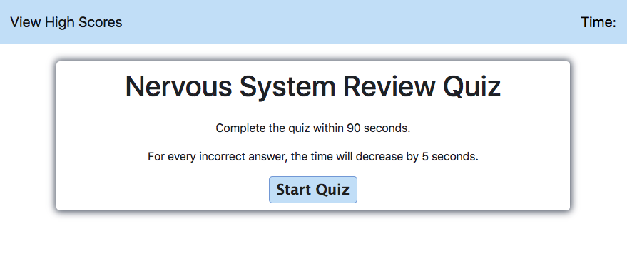

# CodeQuiz-NervousSystem

This program functions as code quiz, specifically testing your knowledge on the Nervous System. Currently working within the healthcare industry I would have loved to have had this type of review quiz to help with my licensure boards. 

## Credits

I had a particularly difficult time building my code, without breaking a separate functioning part of the code. Because of this, I could not be more thankful of my tutor with helping explain the various parts of each code section and help me with understanding how to debug it. 

## Acceptance Criteria
```
GIVEN I am taking a code quiz

WHEN I click the start button
THEN a timer starts and I am presented with a question

WHEN I answer a question
THEN I am presented with another question

WHEN I answer a question incorrectly
THEN time is subtracted from the clock

WHEN all questions are answered or the timer reaches 0
THEN the game is over

WHEN the game is over
THEN I can save my initials and my score
```

## Link to Deployed Application

https://parisa-ostovari.github.io/CodeQuiz-NervousSystem/

## Link to GitHub Repository

https://github.com/parisa-ostovari/CodeQuiz-NervousSystem

## Screenshot
Here is the snapshot of how the website should look like:
 
 When first opened:
